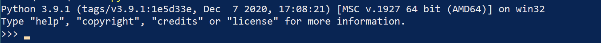
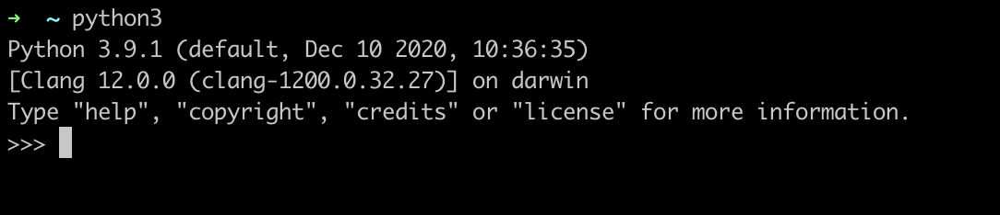

# Elementary Particle Expirement Tutorials  
## Table of Content

- [Environment Configuration](#environment-configuration)
  * [Python](#python)
    + [Windows](#windows)
    + [MacOS](#macos)
    + [Linux distribution](#linux-distribution)
      - [Debian/Ubuntu/Linux Mint](#debian-ubuntu-linux-mint)
  * [Git Installation](#git-installation)
    + [Windows](#windows-1)
    + [MacOS](#macos-1)
    + [Linux distribution](#linux-distribution-1)
      - [Debian/Ubuntu/Linux Mint](#debian-ubuntu-linux-mint-1)
  * [Advanced](#advanced)
    + [Anaconda Installation](#anaconda-installation)
- [After installation](#after-installation)
- [Advice](#Advice)

## Environment Configuration

### Python
Depends on which operating system(OS) you are using, different ways are recommended here to install Python. 

First, we install python3 and then use `pip3`, a package manager for Python, to install Jupyter notebook and other scientific packages. And our tutorials are designed in the format of Jupyter notebook and can be run easily.  


#### Windows

1. Download Python 3.9 from https://www.python.org/downloads/release/python-391/ and install it. *Be sure to check the box that says to add Python 3.9 to your path.* 

2. Run `PowerShell` from the Start menu. Search for it, and just press `Enter` to run it.

3. In your `PowerShell` (Terminal) program, run `python`. You run things in Terminal by just typing the name and pressing Enter. If you type python and it does not run, then you have to reinstall Python and make sure you check the box for “Add python to the PATH.” It’s very small so look carefully.

What you should see: 




#### MacOS

`Homebrew` is recommended here. It calls itself The missing package manager for macOS and is an essential tool for any developer. 

Open a terminal, run
``` bash
/bin/bash -c "$(curl -fsSL https://raw.githubusercontent.com/Homebrew/install/master/install.sh)"
```

You'll be asked to install **Command Line Tools for Xcode** if you have it installed. 

After installation of `Homebrew`, 
``` bash
brew install python3
```

What you should see: 


#### Linux distribution 

##### Debian/Ubuntu/Linux Mint

Open a terminal, and it could be called GNOME Terminal, Konsole, or xterm.

``` bash
sudo apt update 
sudo apt -y upgrade
sudo apt install python python3-pip python-dev 
```


With Python installed, wu run `pip3` to install other packages. 

``` 
pip3 install jupyterlab scipy numpy scipy matplotlib ipython jupyter pandas
```

### Git Installation

#### Windows
To install git, go to [this website](https://git-scm.com/downloads) and download the installer for your operating system. If you do not already have a bash shell installed, make sure to also choose that option for install as git is a terminal application.

On Windows, make sure you configure the terminal emulator to use Windows' default console window. This will make it easier for you to access your computer's files and it is a lot nicer to look at.

#### MacOS

``` bash
brew install git
```

#### Linux distribution 

##### Debian/Ubuntu/Linux Mint

``` bash
sudo apt install git
```

### Advanced 

#### Anaconda Installation 
Anaconda is a Python distribution that makes it easy to install Python plus a number of its most often used 3rd party libraries in a flexible way on a Windows or Linux machine.

To install anaconda, first go to [this website](https://www.anaconda.com/distribution/), and download the installer for Python 3. Once downloaded, follow the install wizard. The default settings are usually good choices. Make sure to choose Anaconda's python kernel as default, as it makes using the different frameworks and plugins much easier.  

On Windows, make sure to select the option "Add Anaconda to my PATH environment variable". There will be red text saying it is not recommended, but you will not be able to access the Anaconda package from your bash terminal with out this option checked.  

If you already have pip and Python 3 installed, you can run ```pip3 install anaconda``` in bash to get Anaconda.  


## After installation
Once you have successfully installed git, python and jupyterlab, create a github account and sign in. You can download the repository by clicking on the green "Clone or Download" button and copy the link next to "Clone with HTTPS". Open up git bash, and type ```git clone [The web address here]```. This will download the repository to your local machine at your home directory. Then, open jupyter notebook either by the Anaconda Navigator or by going to git bash and typing ```jupyter notebook``` (or ```jupyterlab```), then your browser will be open.


Note: as for the notebooks, you are encouraged to do Chapter 12 and the Chapter 13 is optional.

## Advice 

1. Type every line of the codes in your jupyter notebook and run it(Shift + Enter), do not just copy and paste

2. Do exercise 
